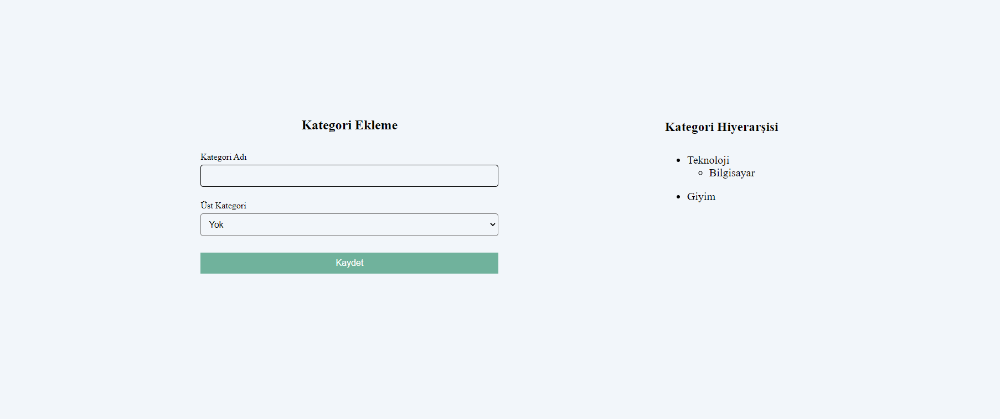

# React Js. İle İç İçe Kategori Oluşturma

- Kullanıcı imputa girmiş olduğu değerleri yan tarafta listeleyebilir.
- İstemiş olduğu kategoriye bir alt kategori ekleyebilir.
- Veriler LocalStorige'e kaydedilmektedir.

## Ekran Görüntüsü

  
## Kullanılan Teknolojiler

* Html - Css
* Javascript
* React Js.(UseSatate, UseEffect)

  
